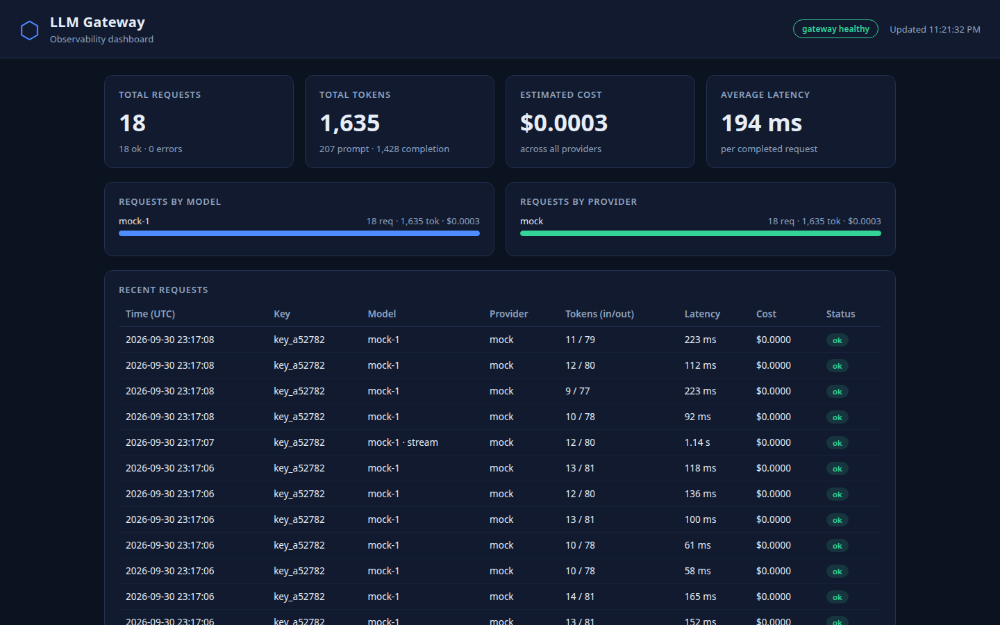
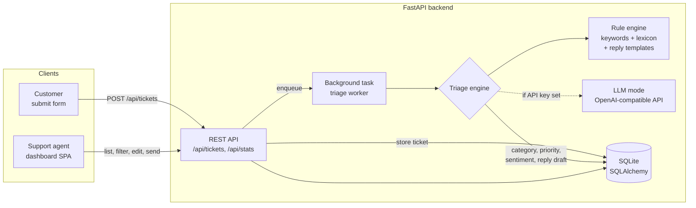

# AI Support Desk

A SaaS-style customer support system with **AI auto-triage**. Customers submit tickets through a web form; the moment a ticket arrives, an AI layer classifies it by **category**, **priority** and **sentiment**, and drafts a **suggested reply** - so agents open a ticket that is already understood and half-answered.

The project is a complete full-stack build: a FastAPI backend, a SQL database, background processing, and a polished single-page agent dashboard. It runs end-to-end **with no paid API keys** - the built-in rule-based triage engine handles everything, and an LLM mode can be switched on with one environment variable.

## Screenshots



The agent dashboard after seeding: stat cards for ticket volume, urgency, resolutions and average sentiment, plus the AI-triaged ticket list with category, priority, sentiment and status badges.

## Architecture



**Design choices worth noting**

- **Intake is decoupled from triage.** Ticket creation returns immediately; triage runs as a background task. Customers never wait on AI, and the AI layer can fail or be swapped without breaking intake.
- **Two interchangeable triage engines** behind one interface: deterministic rules by default, LLM when configured, with automatic fallback to rules if the LLM call fails.
- **Human in the loop.** The AI drafts; the agent reviews, edits and sends. Nothing reaches a customer unreviewed.

## Features

- Public ticket intake endpoint (what a website help form would post to)
- AI auto-triage on every new ticket:
  - **Category** - billing, technical, account, general
  - **Priority** - low, medium, high, urgent (urgency signals + sentiment)
  - **Sentiment** - positive / neutral / negative with a -1..+1 score
  - **Suggested reply** - drafted from category templates (or by the LLM), with an empathy opener for unhappy customers
- Agent dashboard (single-page app, no build step):
  - Live stats: totals, open, urgent+high, resolved, resolution rate, average sentiment
  - Category / sentiment breakdown chips
  - Filterable, searchable ticket table with color-coded badges
  - Slide-in ticket drawer: full conversation, AI triage panel, reply editor, status and assignee controls, re-run triage
  - "Send reply & resolve" flow
- Customer-side demo form that posts real tickets into the same system
- Seed script with 15 realistic sample tickets
- Docker + docker-compose setup

## Tech stack

| Layer | Technology |
| --- | --- |
| Backend | Python, FastAPI, Pydantic |
| Database | SQLite via SQLAlchemy 2.0 (swap `DATABASE_URL` for Postgres) |
| AI triage | Rule/keyword engine + templates; optional OpenAI-compatible LLM |
| Background work | FastAPI BackgroundTasks (queue-ready design) |
| Frontend | Vanilla HTML/CSS/JS single-page app, custom CSS, no CDN dependencies |
| Packaging | Docker, docker-compose |

## Getting started

### Option 1 - Python

```bash
python -m venv .venv
source .venv/bin/activate        # Windows: .venv\Scripts\activate
pip install -r requirements.txt

python -m app.seed               # load 15 sample tickets
uvicorn app.main:app --reload
```

Open <http://localhost:8000> for the dashboard. API docs (Swagger UI) are at <http://localhost:8000/docs>.

### Option 2 - Docker

```bash
docker compose up --build
```

The container seeds demo data on first boot and serves on port 8000.

### Enabling LLM mode (optional)

By default the rule-based engine does all triage - no keys needed. To let a model do it instead:

```bash
cp .env.example .env   # then set OPENAI_API_KEY (and optionally OPENAI_BASE_URL / LLM_MODEL)
```

Works with any OpenAI-compatible endpoint. If the LLM call fails for any reason, triage silently falls back to the rule engine.

## API reference

| Method | Endpoint | Description |
| --- | --- | --- |
| `POST` | `/api/tickets` | Public intake - create a ticket (triggers background triage) |
| `GET` | `/api/tickets` | List tickets; filters: `status`, `priority`, `category`, `search`, `limit`, `offset` |
| `GET` | `/api/tickets/{id}` | Ticket detail |
| `PATCH` | `/api/tickets/{id}` | Update status, assignee, priority, category or draft reply |
| `POST` | `/api/tickets/{id}/reply` | Send a reply to the customer and mark resolved |
| `POST` | `/api/tickets/{id}/retriage` | Re-run AI triage for a ticket |
| `GET` | `/api/stats` | Counts by status/priority/category/sentiment, average sentiment, resolution rate |
| `GET` | `/api/health` | Health check |

Example:

```bash
curl -X POST http://localhost:8000/api/tickets \
  -H "Content-Type: application/json" \
  -d '{
    "customer_name": "Jane Cooper",
    "customer_email": "jane@company.com",
    "title": "Charged twice for my subscription",
    "body": "I was charged twice this month and need a refund for the duplicate payment."
  }'
```

## How the AI triage works

The rule engine scores the combined subject + message text:

1. **Category** - keyword/phrase scoring across billing, technical and account lexicons; highest score wins, otherwise `general`.
2. **Sentiment** - a positive/negative lexicon produces a score from -1 to +1, bucketed into positive / neutral / negative.
3. **Priority** - weighted urgency signals ("urgent", "locked out", "charged twice", "production is down"...) combined with the sentiment: an angry customer with a blocking problem lands at the top of the queue.
4. **Suggested reply** - a per-category template, personalised with the customer's name and issue, plus an empathy opener when sentiment is negative.

The LLM mode asks the model for the same four outputs as structured JSON and validates them before saving.

## Scaling notes

This demo keeps everything in one process on purpose, but the seams are where a production system would split:

- **Triage worker** - `triage_ticket()` is a plain function taking a ticket id. Move it behind Celery / RQ / arq with Redis and nothing else changes; the API already treats triage as asynchronous.
- **Database** - SQLite is fine for a demo; SQLAlchemy models port directly to PostgreSQL by changing `DATABASE_URL`.
- **Sending replies** - the reply endpoint is where an email provider (SES, SendGrid) or a helpdesk integration (Zendesk, Intercom) plugs in.
- **Multi-tenancy** - add an `organization_id` to tickets and scope queries per tenant for a true SaaS deployment.
- **Triage quality** - log agent edits to the suggested replies; that dataset is exactly what you fine-tune or evaluate the next triage model on.

## Project structure

```
ai-support-desk/
├── app/
│   ├── main.py            # FastAPI app, endpoints, background triage hook
│   ├── models.py          # SQLAlchemy ticket model
│   ├── schemas.py         # Pydantic request/response models
│   ├── database.py        # engine, sessions, init
│   ├── config.py          # env-based settings (incl. optional LLM mode)
│   ├── triage.py          # triage engine: rules + optional LLM
│   ├── reply_templates.py # reply drafts per category
│   └── seed.py            # 15 realistic sample tickets
├── static/
│   ├── index.html         # dashboard + customer form (single page)
│   ├── style.css          # custom dashboard styling
│   └── app.js             # dashboard logic
├── Dockerfile
├── docker-compose.yml
├── requirements.txt
└── .env.example
```

## License

MIT
